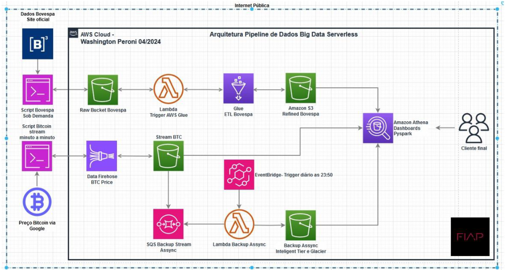
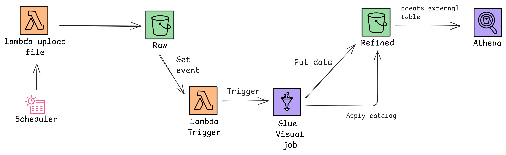

# Tech Challenge 2 - Pipeline Batch Bovespa

## Introdução

Este projeto faz parte do Tech Challenge Fase 2 e tem como objetivo construir um pipeline de dados para extrair, processar e analisar dados do pregão da B3 utilizando serviços da AWS, como o S3, Glue, Lambda e Athena. 



Este README detalha as etapas necessárias para configurar e executar o pipeline, bem como os entregáveis esperados.

---

## Arquitetura

A arquitetura do pipeline segue o diagrama abaixo:

1. **Scraping de Dados**: Extrai os dados do site da B3 e realiza o upload em um bucket S3.
2. **Bucket Raw**: Os dados brutos são enviados para o bucket `Raw` no Amazon S3 em formato Parquet e particionados por data.
3. **Trigger de Lambda**: O upload de arquivos aciona uma função Lambda.
4. **ETL com Glue**: A Lambda dispara um job Glue que realiza transformações nos dados.
5. **Dados Refinados**: Os dados processados são salvos no bucket `Refined` em formato Parquet, particionados por data e abreviação da ação.
6. **Catálogo no Glue**: O Glue cataloga os dados automaticamente e cria uma tabela.
7. **Consulta no Athena**: Os dados estão disponíveis para consulta no Athena.



## Links Importantes

- **Página Oficial da B3 para Scraping**: [https://www.b3.com.br](https://www.b3.com.br)
- **Documentação do AWS CLI**: [https://docs.aws.amazon.com/cli](https://docs.aws.amazon.com/cli)
- **Documentação do Terraform**: [https://developer.hashicorp.com/terraform](https://developer.hashicorp.com/terraform)
- **Guia do AWS Glue**: [https://docs.aws.amazon.com/glue](https://docs.aws.amazon.com/glue)
- **Consulta Athena**: [https://docs.aws.amazon.com/athena](https://docs.aws.amazon.com/athena)

## Requisitos do Projeto

Os seguintes requisitos devem ser atendidos:

1. Realizar scraping de dados do site da B3.
2. Armazenar os dados brutos no bucket `Raw` em formato Parquet.
3. Configurar um bucket S3 que acione uma função Lambda ao receber novos arquivos.
4. Implementar uma função Lambda que dispare um Glue Job.
5. Configurar o Glue Job para realizar as seguintes transformações:
   - Agrupamento numérico e sumarização de dados.
   - Renomear duas colunas do dataset.
   - Realizar cálculos com campos de data.
6. Salvar os dados refinados no bucket `Refined` em formato Parquet, particionados por data e abreviação da ação.
7. Configurar o Glue Catalog para criar tabelas automaticamente.
8. Permitir consultas SQL no Athena utilizando os dados refinados.
9. Garantir que os buckets tenham o versionamento habilitado.

## Pré-requisitos

Antes de iniciar, certifique-se de ter:

- **AWS CLI** instalado e configurado.
- **Terraform** instalado.
- Permissões de acesso à sua conta AWS.

### Instalação do AWS CLI

```bash
sudo apt update && sudo apt upgrade -y
curl "https://awscli.amazonaws.com/awscli-exe-linux-x86_64.zip" -o "awscliv2.zip"
unzip awscliv2.zip
sudo ./aws/install
aws --version
```

### Instalação do Terraform

```bash
sudo apt update && sudo apt upgrade -y
curl -fsSL "https://releases.hashicorp.com/terraform/X.Y.Z/terraform_X.Y.Z_linux_amd64.zip" -o terraform.zip
unzip terraform.zip
sudo mv terraform /usr/local/bin/
terraform --version
```

### Configuração do AWS CLI

Configure suas credenciais AWS:

```bash
aws configure
```

### Para esse processo é necessário fornecer:

- Access Key ID
- Secret Access Key
- Região padrão (ex.: `us-east-1`)

---

## Configuração e Execução do Pipeline

1. Clone este repositório.
2. Use o Terraform para criar os recursos AWS necessários:
   ```bash
   terraform init
   terraform apply
   ```
3. Certifique-se de que os buckets, funções Lambda e Glue Jobs foram criados corretamente.

---

## Scraping de Dados

### Descrição

Esta etapa é responsável por extrair dados da B3 utilizando a API disponível executar a limpeza dos dados e fazer o upload para o bucket `Raw` no S3. O processo foi construindo utilizando a linguagem Python e as bibliotecas:  `boto3`, `pandas`, `selenium`, `pydantic`.

### Dependências

- `boto3`
- `pandas`
- `selenium`
- `pydantic`

Instale as dependências com:

```bash
pip install boto3 pandas selenium pydantic
```

### Código de Exemplo (necessário?)

O código a seguir realiza o scraping e salva os dados em formato Parquet no S3:

---

## Detalhes do Pipeline

(ver daqui pra baixo)
### Lambda Function

- **Descrição**: Responsável por acionar o Glue Job ao detectar novos arquivos no bucket `Raw`.
- **Tecnologia**: Implementada em Python.

### Glue Job

- **Descrição**: Não foi feito no modo visual e será explicado melhor nas observações.
- **Transformações**: Atende os requisitos de agrupação, renomeação de colunas e cálculos de data.

### S3 Buckets

- `Raw`: Armazena os dados brutos enviados pelo scraping.
- `Refined`: Armazena os dados processados e otimizados para consulta.

### Athena

- **Descrição**: Permite consultas SQL nos dados refinados.
- **Configurações**: Utiliza o Glue Catalog como metadados.

---

## Como Testar

1. Realize o upload de um arquivo no bucket `Raw`.
2. Verifique no console da AWS se o Glue Job foi acionado automaticamente.
3. Confirme que os dados processados foram salvos no bucket `Refined`.
4. Consulte os dados processados no Athena utilizando SQL.

---

## Observações

- Utilizamos 
